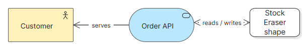

# ArchiMate-symboler for Eraser Diagrams

Et visuelt tillegg til Node-biblioteket `@eraserlabs/diagrams`. Lag diagrammer med ArchiMate 4-navn, symboler og relasjonsstiler sammen med Erasers vanlige komponenter. Tillegget krever ingen fork. Det brukes gjennom JSON og Node, og er ikke en utvidelse som installeres i Erasers nettredigerer.

**Innhold:** 42 elementtyper, to junction-symboler, 11 relasjonspresentasjoner og to skills for LLM-bruk. SVG-tegningene er egne, forenklede varianter. Fullt grafisk samsvar med standarden er ikke verifisert, og biblioteket validerer ikke hvilke ArchiMate-relasjoner som er lovlige. Se [dekning og begrensninger](docs/NOTATION.md).



## Bruk med Claude eller en annen LLM

Åpne repoet i verktøyet du bruker, slik at assistenten kan lese filer og kjøre kommandoer. **Be eksplisitt om at den leser skillene.** At filene ligger i repoet betyr ikke at alle LLM-verktøy automatisk oppdager eller aktiverer dem. Du trenger ikke installere dem globalt for å bruke fremgangsmåten nedenfor.

| Skill | Når den brukes |
| --- | --- |
| [eraser-archimate](skills/eraser-archimate/SKILL.md) | Ved tegning og redigering. Beskriver faktiske JSON-felt, komponentvalg, styling og rendering med tillegget. |
| [archimate-modeling](skills/archimate-modeling/SKILL.md) | Når du også vil ha hjelp med begreper, avgrensning og relasjonsbetydning. Uavhengig modelleringsveiledning, uten komplett ArchiMate 4-regelkontroll. |

Kopier denne instruksjonen, og erstatt siste avsnitt med ditt behov:

```text
Bruk dette repoets Eraser-utvidelse til å lage diagrammet.
Les skills/eraser-archimate/SKILL.md og referansene den ber deg lese
før du lager JSON. Bruk også skills/archimate-modeling/SKILL.md
for modelleringsvalg, og oppgi eventuelle faglige usikkerheter.

Slå opp støttede tagger og felter med skillens describe-library-script.
Lagre redigerbar kilde i output/mitt-diagram.source.json.
Render med repoets script til output/mitt-diagram og kontroller
PNG/HTML visuelt hvis du har tilgang til å åpne dem.
Lever lenker til kilde, PNG og HTML. Oppgi hva du faktisk kontrollerte.

Diagrammet skal vise: [målgruppe, formål, elementer og sammenhenger].
```

Ved senere endringer: be assistenten lese samme skill og redigere `output/mitt-diagram.source.json`. Behold kildefilen, siden den genererte `output/mitt-diagram.json` er rendererens bearbeidede resultat. `output/` er ignorert av Git og er egnet for lokale arbeidsfiler; ta egne sikkerhetskopier ved behov.

Begge skillene følger `SKILL.md`-formatet og følger med repoet og pakken. De er ikke offisielle The Open Group-skills. Eventuell installasjon i assistentens personlige skill-mappe gjøres etter instruksjonene for det verktøyet. Installerte kopier må oppdateres separat når repoet endres.

## Installer og prøv lokalt

Krever Git, Node.js 22.12 eller nyere og Chrome eller Chromium. CI bruker Node.js 24. Pakken er ikke publisert på npm. Kjør følgende i PowerShell; har du allerede repoet, start med å gå til rotmappen:

```powershell
git clone https://github.com/Lossfelt/eraser-diagrams-archimate.git
cd eraser-diagrams-archimate
npm.cmd ci --ignore-scripts --cache .npm-cache
npm.cmd run render
npm.cmd run gallery
```

Åpne `output/mixed.html` eller `output/mixed.png` for et eksempel med både ArchiMate- og standardkomponenter. `output/gallery.html` og `output/gallery.png` viser alle symbolene og relasjonsstilene.

På Windows bruker skriptene `C:/Program Files/Google/Chrome/Application/chrome.exe` som standard. Ved annen plassering setter du nettleserbanen før rendering:

```powershell
$env:CHROME_PATH = 'C:/sti/til/chrome.exe'
```

På Linux/macOS bruker du `npm` i stedet for `npm.cmd` og setter `CHROME_PATH` til nettleserens kjørbare fil. Du kan også installere Chromium med Playwright:

```sh
npx playwright install chromium
export CHROME_PATH="$(node --input-type=module -e "import {chromium} from 'playwright'; console.log(chromium.executablePath())")"
npm run render
```

## Lag eller endre et diagram

En enkel start er å kopiere det medfølgende eksemplet. Kjør fra repoets rotmappe:

```powershell
New-Item -ItemType Directory -Force output | Out-Null
Copy-Item examples/mixed.json output/mitt-diagram.source.json
npm.cmd run render -- output/mitt-diagram.source.json mitt-diagram
```

Rediger kildefilen selv eller med en LLM, og kjør render-kommandoen på nytt. Den lager følgende filer og erstatter tidligere resultater med samme navn:

| Fil | Bruk |
| --- | --- |
| `output/mitt-diagram.png` | Bilde til dokumenter og presentasjoner. |
| `output/mitt-diagram.html` | Visning i nettleseren. |
| `output/mitt-diagram.json` | Bearbeidet JSON fra rendereren, nyttig ved feilsøking. |

Det siste argumentet, `mitt-diagram`, er et filnavnprefiks uten filendelse eller mappeseparatorer. Kilde-JSON må ha et annet navn enn resultatfilen, som i eksemplet over.

JSON har `entities` og `connections`. Elementer får eksplisitte `x`/`y`-koordinater. Egne tagger begynner med `Am`, for eksempel `AmApplicationComponent`, `AmService` og `AmServing`. Bruk `name` på elementer og `label` på relasjoner. Tilleggets `AmNode` og Erasers `Node` er forskjellige komponenter.

Les [JSON- og stylingveiledningen](skills/eraser-archimate/references/authoring.md) for et minimalt eksempel, farger og pilretninger. Etter installasjon kan du slå opp katalogen og de faktiske feltene slik:

```powershell
node skills/eraser-archimate/scripts/describe-library.mjs .
node skills/eraser-archimate/scripts/describe-library.mjs . AmService AmServing Shape
```

## Bruk i et annet Node-prosjekt

Lag først en pakkefil fra repoets rot:

```powershell
New-Item -ItemType Directory -Force output | Out-Null
npm.cmd pack --pack-destination output
```

Gå deretter til ditt eget Node-prosjekt og installer pakkefilen sammen med den støttede Eraser-versjonen. Erstatt stien med den faktiske plasseringen:

```powershell
npm.cmd install 'C:/sti/til/eraser-archimate-visuals-0.1.0.tgz' @eraserlabs/diagrams@0.1.0
```

Lagre eksemplet under som `render.mjs`. Sett `CHROME_PATH` som beskrevet over, og kjør `node render.mjs`:

```js
import { writeFile } from 'node:fs/promises';
import { createRenderer } from '@eraserlabs/diagrams';
import { library, normalizers } from 'eraser-archimate-visuals';

if (!process.env.CHROME_PATH) throw new Error('Sett CHROME_PATH til Chrome/Chromium');
const renderer = await createRenderer({
  library,
  normalizers,
  chromiumPath: process.env.CHROME_PATH,
});

try {
  const result = await renderer.render({
    entities: [
      { tag: 'AmApplicationComponent', id: 'api', name: 'API', x: 30, y: 30 },
      { tag: 'AmService', id: 'service', name: 'Kundetjeneste', x: 300, y: 30 },
    ],
    connections: [
      { tag: 'AmRealization', from: 'api', to: 'service' },
    ],
    outputs: { html: true, png: true },
  });
  if (!result.ok) throw new Error(JSON.stringify(result.errors));
  await writeFile('diagram.html', result.html);
  await writeFile('diagram.png', result.png);
} finally {
  await renderer.close();
}
```

`library` inkluderer allerede Erasers standardbibliotek. Send også med `normalizers`, som viderefører Erasers egne normalizers og setter tilleggets visuelle standardverdier. Ved direkte bruk av kildekoden fra repoets rot importerer du fra `./src/index.js` i stedet for pakkenavnet.

## Bare SVG-symbolene

Filene i [icons/](icons/) kan brukes separat uten Node eller Eraser. Fra en installert pakke kan du også hente SVG som tekst:

```js
import { getIcon } from 'eraser-archimate-visuals';
const svg = getIcon('ApplicationComponent');
```

Bruk navnet uten `Am`-prefiks. Funksjonen returnerer et komplett SVG-symbol, eller `undefined` ved ukjent navn. Den registrerer ingen ny ikonleverandør i Eraser. Ferdige Eraser-komponenter får symbolene via `library`.

## Feilsøking og avgrensning

| Problem | Tiltak |
| --- | --- |
| LLM-en bruker ikke tillegget | Bruk instruksjonen øverst, og kontroller at assistenten kan lese repoets skill-filer. |
| Ukjent tag eller felt | Slå opp skjemaet. Bruk for eksempel `AmService`, ikke `AmApplicationService`, og `bgColor`, ikke `fillColor`. |
| Chrome/Chromium blir ikke funnet | Sett `CHROME_PATH` til en eksisterende kjørbar fil. |
| Elementer overlapper eller teksten blir trang | Juster `x`, `y`, `width` og `height` i kildefilen, render på nytt og åpne resultatet. |
| Diagrammet rendres, men modellen virker faglig feil | Rendering er ingen ArchiMate-lovlighetskontroll. Bruk modelleringsskillen og relevante versjonerte kilder for faglig vurdering. |

HTML-resultatet er en visning. En egen Svelte-editor er et mulig senere steg og inngår ikke i denne utgaven.

## Dokumentasjon og bidrag

- [Utvikling](DEVELOPMENT.md): tester, ikongenerering og CI.
- [Kontrollert leveranse](docs/VERIFICATION.md): hva som er testet og kjente avhengighetsfunn.
- [Notasjon](docs/NOTATION.md): dekning, kilder og visuelle begrensninger.
- [Integrasjonsvalg](docs/INTEGRATION.md): hvordan tillegget fungerer sammen med Eraser.
- [Avklaringer](docs/CLARIFICATIONS.md): kilde- og tilgangsspørsmål.
- [Plan](PLAN.md): avgrensning og mulig videre arbeid.

ArchiMate® er et registrert varemerke for The Open Group. Dette er et uavhengig prosjekt, uten godkjenning eller sertifisering fra The Open Group. Koden og de egne SVG-tegningene er tilgjengelige under [MIT-lisensen](LICENSE).
